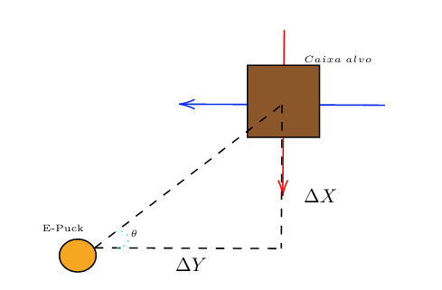

# Robotics
Repositório com atividades da matéria de robótica e inteligência artificial.

# Atividade 1 - Trajetória robô
A atividade 1 tem como objetivo definir um algoritmo em que o robô seja capaz
de deslocar-se pelo cenário e encostar, pelo meno uma vez, em cada caixa disposta.

## Resumo do algoritmo
Foram consideradas algumas premissas iniciais para que o algoritmo fosse desenvolvido,
são elas:
 * A posição de toda caixa é conhecida previamente.
 * A posição do robô é conhecida e atualizada.
 * A velocidade rotacional e tangencial do robô é conhecida.
 * Não existem obstáculos no cenário além das próprias caixas.

O algoritmo baseia-se na ideia de calcular a distância à caixa não visitada mais
próxima e então calcular o ângulo theta entre o robô e o centro da caixa que será
utilizado para rotacionar a frente do robô em direção à caixa.

